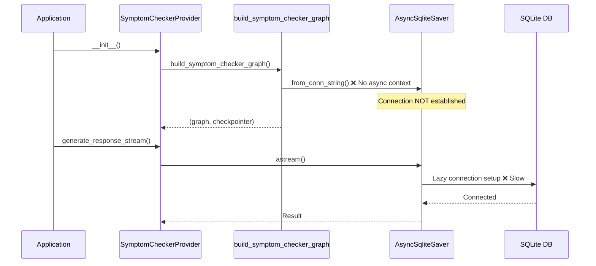
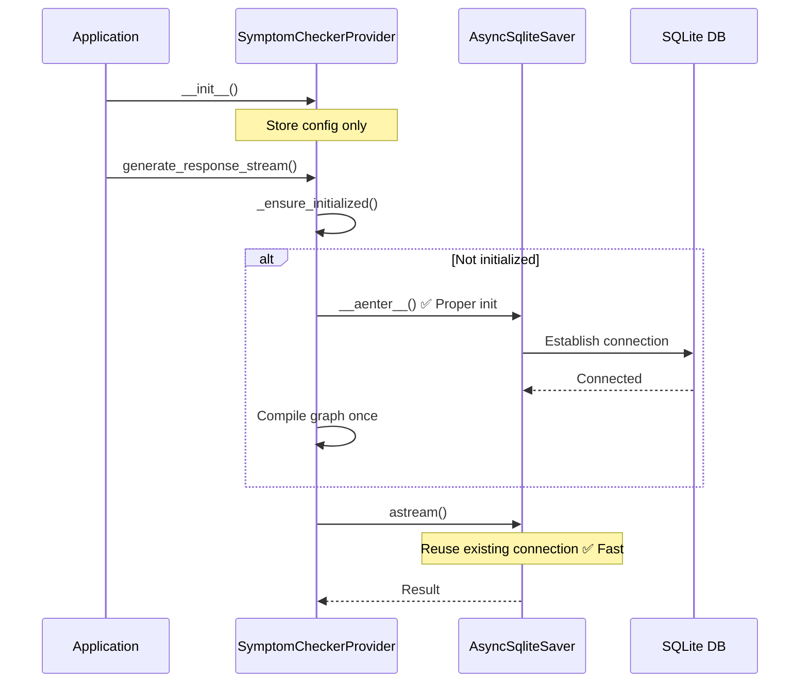

# Design Document: Checkpointer Performance Fix

## Overview

This design addresses a performance issue in the `SymptomCheckerProvider` where the `AsyncSqliteSaver` checkpointer is improperly initialized. The current implementation calls `AsyncSqliteSaver.from_conn_string()` outside of an async context manager, which means:

1. The SQLite connection is not properly established at startup
2. Connection setup happens lazily on each operation
3. Each graph operation may incur connection overhead

The fix involves:
- Using a persistent connection pattern for the checkpointer
- Ensuring proper async initialization at provider startup
- Reusing the compiled graph and checkpointer across all requests

## Architecture

### Current (Problematic) Flow



### Fixed Flow



## Components and Interfaces

### Modified SymptomCheckerProvider Class

```python
class SymptomCheckerProvider(ILLMProvider, ICheckpointManager):
    """Medical symptom checker using LangGraph workflow with optimized checkpointing."""
    
    def __init__(
        self,
        api_key: str,
        checkpoint_db_path: str = "checkpoints.db",
        model_name: str = "gpt-4o-mini",
        temperature: float = 0.3,
    ):
        """Initialize provider configuration (lazy initialization)."""
        self.api_key = api_key
        self.checkpoint_db_path = checkpoint_db_path
        self.model_name = model_name
        self.temperature = temperature
        
        # Lazy initialization - these are set on first use
        self._graph: CompiledGraph | None = None
        self._checkpointer: AsyncSqliteSaver | None = None
        self._initialized: bool = False
        self._lock: asyncio.Lock = asyncio.Lock()
    
    async def _ensure_initialized(self) -> None:
        """Ensure checkpointer and graph are initialized (thread-safe)."""
        if self._initialized:
            return
        
        async with self._lock:
            if self._initialized:  # Double-check after acquiring lock
                return
            
            # Initialize checkpointer with proper async context
            self._checkpointer = AsyncSqliteSaver.from_conn_string(self.checkpoint_db_path)
            await self._checkpointer.__aenter__()
            
            # Build and compile graph once
            self._graph = self._build_graph()
            self._initialized = True
    
    async def cleanup(self) -> None:
        """Clean up resources (call on application shutdown)."""
        if self._checkpointer is not None:
            await self._checkpointer.__aexit__(None, None, None)
            self._checkpointer = None
            self._graph = None
            self._initialized = False
```

### Modified build_symptom_checker_graph Function

The graph builder will be simplified to not create the checkpointer - that responsibility moves to the provider:

```python
def build_symptom_checker_graph(
    api_key: str,
    model_name: str = "gpt-4o-mini",
    temperature: float = 0.3,
    checkpointer: BaseCheckpointSaver | None = None,
) -> CompiledStateGraph:
    """Build and compile the symptom checker LangGraph.
    
    Args:
        api_key: OpenAI API key
        model_name: Name of the OpenAI model to use
        temperature: Temperature for LLM responses
        checkpointer: Pre-initialized checkpointer (required for persistence)
        
    Returns:
        Compiled graph ready for use
    """
    # ... build graph nodes and edges ...
    
    # Compile with provided checkpointer
    return builder.compile(checkpointer=checkpointer)
```

## Data Models

No changes to data models. The fix is purely about resource lifecycle management.

## Correctness Properties

*A property is a characteristic or behavior that should hold true across all valid executions of a system-essentially, a formal statement about what the system should do. Properties serve as the bridge between human-readable specifications and machine-verifiable correctness guarantees.*

### Property 1: Connection reuse across requests
*For any* sequence of N requests (N >= 2) to the same SymptomCheckerProvider instance, the checkpointer SHALL use the same database connection for all requests.
**Validates: Requirements 1.1, 1.2, 2.3**

### Property 2: Graph instance reuse
*For any* sequence of N requests (N >= 2) to the same SymptomCheckerProvider instance, the compiled graph object SHALL be the same instance for all requests.
**Validates: Requirements 3.1, 3.2**

### Property 3: Functional correctness after reuse
*For any* SymptomCheckerProvider instance that has processed at least one request, subsequent requests SHALL complete successfully without errors.
**Validates: Requirements 3.3, 4.1**

## Error Handling

| Error Condition | Handling Strategy |
|-----------------|-------------------|
| Checkpointer initialization failure | Raise `LLMProviderException` with descriptive message |
| Database file not writable | Raise `LLMProviderException` on first request |
| Concurrent initialization race | Use asyncio.Lock to ensure single initialization |
| Cleanup called during active request | Lock ensures cleanup waits for request completion |

## Testing Strategy

### Dual Testing Approach

- **Unit tests**: Verify initialization, cleanup, and error handling
- **Property-based tests**: Verify connection and graph reuse properties

### Property-Based Testing Framework

**Library**: `hypothesis` (Python) with `pytest-asyncio`
**Minimum iterations**: 100 per property test

### Test Categories

1. **Resource Reuse Properties** (Properties 1-2)
   - Track object identity across multiple requests
   - Verify no new connections/graphs created after initialization

2. **Functional Properties** (Property 3)
   - Execute multiple requests and verify all succeed
   - Test interrupt/resume cycle works after reuse

### Test Annotations

Each property-based test MUST include a comment in this format:
```python
# **Feature: checkpointer-performance-fix, Property {number}: {property_text}**
```

### Unit Test Coverage

- Lazy initialization behavior
- Thread-safe initialization with asyncio.Lock
- Cleanup properly closes connection
- Backward compatibility with existing ILLMProvider interface

