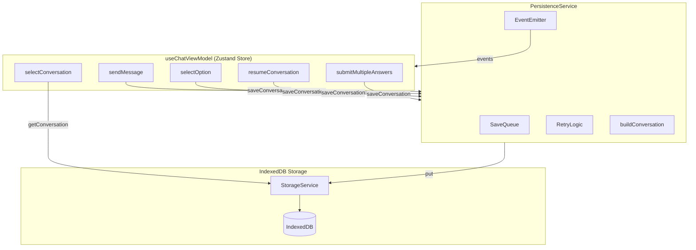

# Design Document: Data Persistence Consistency

## Overview

This design introduces a centralized `PersistenceService` that replaces the scattered, duplicated `saveToStorage` helper functions currently embedded in the ViewModel actions. The service provides reliable conversation persistence with retry logic, sequential queuing, and proper graph state handling.

The key architectural change is moving from fire-and-forget inline saves to a proper service layer that:
1. Guarantees save completion before critical UI state changes
2. Handles failures with retry logic
3. Prevents race conditions with per-conversation queues
4. Includes graph state in all saves

## Architecture



## Components and Interfaces

### PersistenceService Interface

```typescript
/**
 * Events emitted by the PersistenceService.
 */
interface PersistenceEvents {
  saveStarted: { conversationId: string; messageCount: number; hasGraphState: boolean };
  saveCompleted: { conversationId: string; durationMs: number };
  saveFailed: { conversationId: string; error: string; errorCode: StorageErrorCode };
  queueUpdated: { conversationId: string; queueDepth: number };
}

/**
 * Save request containing all data needed to persist a conversation.
 */
interface SaveRequest {
  conversationId: string;
  messages: Message[];
  threadId: string | null;
  isInterrupted: boolean;
  pendingQuestion: string | null;
  pendingOptions: string[];
  pendingQuestions: QuestionWithOptions[];
  graphState: GraphState;
  existingCreatedAt?: string;
}

/**
 * Centralized persistence service interface.
 */
interface IPersistenceService {
  /**
   * Save a conversation with retry and queue logic.
   * Returns a promise that resolves when save completes or rejects after all retries fail.
   */
  saveConversation(request: SaveRequest): Promise<void>;
  
  /**
   * Check if a conversation has pending saves.
   */
  isSaving(conversationId: string): boolean;
  
  /**
   * Check if any conversation has pending saves.
   */
  hasPendingSaves(): boolean;
  
  /**
   * Subscribe to persistence events.
   */
  on<K extends keyof PersistenceEvents>(
    event: K,
    handler: (data: PersistenceEvents[K]) => void
  ): () => void;
  
  /**
   * Get the current queue depth for a conversation.
   */
  getQueueDepth(conversationId: string): number;
}
```

### PersistenceService Implementation

```typescript
class PersistenceService implements IPersistenceService {
  private queues: Map<string, SaveRequest[]> = new Map();
  private processing: Set<string> = new Set();
  private eventHandlers: Map<string, Set<Function>> = new Map();
  
  private readonly MAX_RETRIES = 3;
  private readonly RETRY_DELAYS = [100, 200, 400]; // exponential backoff
  
  async saveConversation(request: SaveRequest): Promise<void> {
    const { conversationId } = request;
    
    // Add to queue, replacing any pending save with newer data
    this.enqueue(request);
    
    // If not already processing this conversation, start processing
    if (!this.processing.has(conversationId)) {
      await this.processQueue(conversationId);
    }
  }
  
  private enqueue(request: SaveRequest): void {
    const { conversationId } = request;
    const queue = this.queues.get(conversationId) || [];
    
    // Replace pending save with newer data (optimization)
    if (queue.length > 0) {
      queue[queue.length - 1] = request;
    } else {
      queue.push(request);
    }
    
    this.queues.set(conversationId, queue);
    this.emit('queueUpdated', { conversationId, queueDepth: queue.length });
  }
  
  private async processQueue(conversationId: string): Promise<void> {
    this.processing.add(conversationId);
    
    try {
      while (true) {
        const queue = this.queues.get(conversationId);
        if (!queue || queue.length === 0) break;
        
        const request = queue.shift()!;
        this.emit('queueUpdated', { conversationId, queueDepth: queue.length });
        
        await this.saveWithRetry(request);
      }
    } finally {
      this.processing.delete(conversationId);
      this.queues.delete(conversationId);
    }
  }
  
  private async saveWithRetry(request: SaveRequest): Promise<void> {
    const startTime = Date.now();
    const { conversationId, messages, graphState } = request;
    
    this.emit('saveStarted', {
      conversationId,
      messageCount: messages.length,
      hasGraphState: !!graphState,
    });
    
    let lastError: Error | null = null;
    
    for (let attempt = 0; attempt <= this.MAX_RETRIES; attempt++) {
      try {
        const storedConversation = this.buildStoredConversation(request);
        const storageService = getStorageService();
        await storageService.saveConversation(storedConversation);
        
        const durationMs = Date.now() - startTime;
        this.emit('saveCompleted', { conversationId, durationMs });
        return;
        
      } catch (error) {
        lastError = error as Error;
        
        // Don't retry quota exceeded errors
        if (error instanceof StorageError && error.code === 'QUOTA_EXCEEDED') {
          this.emit('saveFailed', {
            conversationId,
            error: error.message,
            errorCode: 'QUOTA_EXCEEDED',
          });
          throw error;
        }
        
        // Log retry attempt
        console.error(`Save attempt ${attempt + 1} failed for ${conversationId}:`, error);
        
        // Wait before retry (except on last attempt)
        if (attempt < this.MAX_RETRIES) {
          await this.delay(this.RETRY_DELAYS[attempt]);
        }
      }
    }
    
    // All retries exhausted
    this.emit('saveFailed', {
      conversationId,
      error: lastError?.message || 'Unknown error',
      errorCode: 'UNKNOWN',
    });
    throw lastError;
  }
  
  private buildStoredConversation(request: SaveRequest): StoredConversation {
    const now = new Date().toISOString();
    
    return {
      id: request.conversationId,
      title: this.generateTitle(request.messages),
      messages: request.messages.map(this.messageToStoredMessage),
      created_at: request.existingCreatedAt || now,
      updated_at: now,
      version: 1,
      thread_id: request.threadId || request.conversationId,
      is_interrupted: request.isInterrupted,
      pending_question: request.pendingQuestion || undefined,
      pending_options: request.pendingOptions.length > 0 ? request.pendingOptions : undefined,
      pending_questions: request.pendingQuestions.length > 0 
        ? request.pendingQuestions.map(this.questionToStoredQuestion) 
        : undefined,
      graph_state: {
        completed_stages: request.graphState.completedStages,
        waiting_node_id: request.graphState.waitingNodeId,
        stages_live_data: request.graphState.stagesLiveData as Record<string, Record<string, unknown>>,
      },
    };
  }
  
  // ... helper methods (generateTitle, messageToStoredMessage, etc.)
}
```

### ViewModel Integration

The ViewModel will be updated to use the PersistenceService instead of inline saves:

```typescript
// Before (current implementation - duplicated in each action)
const saveToStorage = (...): void => {
  if (!isStorageAvailable) return;
  safeStorageOperation(async () => {
    // ... inline save logic
  });
};

// After (using PersistenceService)
const { graphState, isStorageAvailable } = get();
if (isStorageAvailable) {
  await persistenceService.saveConversation({
    conversationId: finalConvId,
    messages: finalMessages,
    threadId: result.threadId,
    isInterrupted: true,
    pendingQuestion: result.question || null,
    pendingOptions: result.options || [],
    pendingQuestions: result.questions || [],
    graphState,
  });
}
```

## Data Models

### StoredConversation (Updated)

The existing `StoredConversation` type already supports `graph_state`, but it's not being populated. The design ensures it's always included:

```typescript
interface StoredConversation {
  id: string;
  title: string | null;
  messages: StoredMessage[];
  created_at: string;
  updated_at: string;
  version: number;
  thread_id: string;
  is_interrupted: boolean;
  pending_question?: string;
  pending_options?: string[];
  pending_questions?: StoredQuestionWithOptions[];
  graph_state?: StoredGraphState;  // Now always populated on save
}

interface StoredGraphState {
  completed_stages: string[];
  waiting_node_id: string | null;
  stages_live_data: Record<string, Record<string, unknown>>;
}
```

### SaveRequest

New type for passing complete state to the PersistenceService:

```typescript
interface SaveRequest {
  conversationId: string;
  messages: Message[];
  threadId: string | null;
  isInterrupted: boolean;
  pendingQuestion: string | null;
  pendingOptions: string[];
  pendingQuestions: QuestionWithOptions[];
  graphState: GraphState;
  existingCreatedAt?: string;
}
```

## Correctness Properties

*A property is a characteristic or behavior that should hold true across all valid executions of a system-essentially, a formal statement about what the system should do. Properties serve as the bridge between human-readable specifications and machine-verifiable correctness guarantees.*

### Property 1: Round-trip data preservation
*For any* valid SaveRequest, saving the conversation and then loading it SHALL return data equivalent to the original request, including messages, interrupt state, and graph state.
**Validates: Requirements 1.2, 4.1, 4.2, 6.3**

### Property 2: Retry with exponential backoff
*For any* save operation that fails with a retryable error, the PersistenceService SHALL retry up to 3 times with delays of 100ms, 200ms, and 400ms between attempts.
**Validates: Requirements 2.1**

### Property 3: Sequential queue processing
*For any* sequence of save operations to the same conversation, the saves SHALL complete in the order they were queued, with no overlapping execution.
**Validates: Requirements 3.1, 3.2**

### Property 4: Queue optimization (newer replaces pending)
*For any* conversation with a pending save in the queue, a new save request SHALL replace the pending save, resulting in only the newest data being persisted.
**Validates: Requirements 3.3**

### Property 5: Parallel saves for different conversations
*For any* two save operations to different conversations, the saves SHALL be able to execute concurrently without blocking each other.
**Validates: Requirements 3.4**

### Property 6: isSaving state consistency
*For any* conversation, the `isSaving` state SHALL be true while a save is in progress and false when all saves complete.
**Validates: Requirements 5.1, 5.2**

### Property 7: Event emission lifecycle
*For any* save operation, the PersistenceService SHALL emit `saveStarted` when beginning, and either `saveCompleted` on success or `saveFailed` after all retries are exhausted.
**Validates: Requirements 7.1, 7.2, 7.3**

### Property 8: Interrupt save ordering
*For any* interrupt event, the ViewModel SHALL await save completion before setting `isWaitingForInput` to true in the UI state.
**Validates: Requirements 6.1**

## Error Handling

### Retry Strategy

| Error Type | Retry? | Max Attempts | Backoff |
|------------|--------|--------------|---------|
| Network/Transient | Yes | 3 | 100ms, 200ms, 400ms |
| QuotaExceededError | No | 1 | N/A |
| Database Unavailable | No | 1 | N/A |

### Error Events

The PersistenceService emits `saveFailed` events that the ViewModel can handle:

```typescript
persistenceService.on('saveFailed', ({ conversationId, error, errorCode }) => {
  if (errorCode === 'QUOTA_EXCEEDED') {
    set({ storageError: 'Storage full. Please delete old conversations.' });
  } else {
    set({ storageError: `Failed to save: ${error}` });
  }
});
```

### Beforeunload Warning

When `hasPendingSaves()` returns true, the application registers a beforeunload handler:

```typescript
useEffect(() => {
  const handleBeforeUnload = (e: BeforeUnloadEvent) => {
    if (persistenceService.hasPendingSaves()) {
      e.preventDefault();
      e.returnValue = 'You have unsaved changes. Are you sure you want to leave?';
    }
  };
  
  window.addEventListener('beforeunload', handleBeforeUnload);
  return () => window.removeEventListener('beforeunload', handleBeforeUnload);
}, []);
```

## Testing Strategy

### Dual Testing Approach

This feature requires both unit tests and property-based tests:

- **Unit tests**: Verify specific examples, edge cases, and integration points
- **Property-based tests**: Verify universal properties hold across all valid inputs

### Property-Based Testing Library

We will use **fast-check** (already available in the project) for property-based testing.

Each property-based test will:
1. Run a minimum of 100 iterations
2. Be tagged with a comment referencing the correctness property
3. Use generators for SaveRequest, Message, and GraphState

### Test Categories

1. **PersistenceService Unit Tests**
   - Save with valid data
   - Retry on transient failure
   - No retry on quota exceeded
   - Queue processing order
   - Event emission

2. **PersistenceService Property Tests**
   - Round-trip preservation (Property 1)
   - Retry behavior (Property 2)
   - Queue ordering (Property 3)
   - Queue optimization (Property 4)
   - Parallel saves (Property 5)
   - isSaving state (Property 6)
   - Event lifecycle (Property 7)

3. **ViewModel Integration Tests**
   - Interrupt save ordering (Property 8)
   - Graph state restoration
   - Error handling propagation
