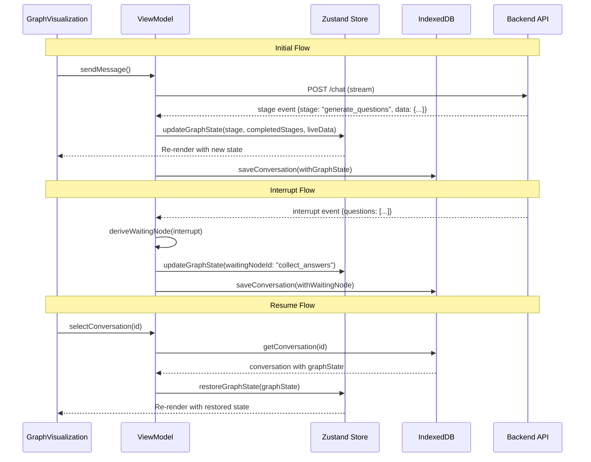

# Design Document: Graph Visualization Fixes

## Overview

This design addresses fundamental architectural issues in the graph visualization feature where state is currently split between frontend React state, Zustand store, and backend LangGraph checkpoints. The refactoring establishes a single source of truth for graph state, ensures consistency between initial and resume flows, and properly persists graph visualization state across browser sessions.

The solution follows SOLID principles to create a maintainable, testable architecture with clear separation of concerns.

### Alignment with Existing Architecture

This design aligns with the project's established MVVM architecture:

| Layer | Existing | This Design |
|-------|----------|-------------|
| View | ChatPage.tsx, GraphVisualization.tsx | No changes - reads from ViewModel |
| ViewModel | useChatViewModel.ts (Zustand) | Uses GraphStateService |
| Service | api.ts, **graphStateService.ts** (new) | New service for graph logic |
| Storage | indexedDBStorage.ts | Extended schema for graph state |

**Implementation Approach: New GraphStateService Module**

A dedicated module provides better maintainability and testability:

```
frontend/
├── services/
│   ├── api.ts                    # Existing API service
│   ├── graphStateService.ts      # NEW: Graph state logic
│   └── storage/
│       ├── types.ts              # Extended with graph state types
│       └── indexedDBStorage.ts   # Extended schema
├── viewmodels/
│   └── useChatViewModel.ts       # Uses GraphStateService
└── types/
    └── graph.ts                  # Existing graph types
```

**Why a separate module is better:**
- **Testable in isolation**: Unit test graph logic without mocking Zustand
- **Single Responsibility**: ViewModel orchestrates, GraphStateService handles graph transitions
- **Reusable**: Other components can use the same service if needed
- **Easier debugging**: All graph state transitions in one place

Key architectural principles maintained:
- **Dependency Inversion**: ViewModel depends on IGraphStateService interface
- **Zustand as State Manager**: Consistent with existing pattern
- **IndexedDB for Persistence**: Extends existing storage pattern

## Architecture

### Current State (Problems)

```
┌─────────────────────────────────────────────────────────────────┐
│                     Current Architecture                         │
├─────────────────────────────────────────────────────────────────┤
│  ChatPage (React State)     Zustand Store      Backend          │
│  ├─ currentStage           ├─ messages        ├─ LangGraph      │
│  ├─ completedStages        ├─ threadId        │  Checkpoints    │
│  ├─ liveData               ├─ isWaiting       │                 │
│  └─ waitingNode            └─ ...             │                 │
│                                                                  │
│  Problems:                                                       │
│  • State scattered across 3 locations                           │
│  • No persistence of graph state to IndexedDB                   │
│  • "processing" pseudo-stage on resume breaks mapping           │
│  • Waiting node not derived consistently                        │
└─────────────────────────────────────────────────────────────────┘
```

### Target State (Solution)

```
┌─────────────────────────────────────────────────────────────────┐
│                     Target Architecture                          │
├─────────────────────────────────────────────────────────────────┤
│                                                                  │
│  ┌──────────────────────────────────────────────────────────┐   │
│  │              Zustand Store (Single Source of Truth)       │   │
│  │  ├─ messages: Message[]                                   │   │
│  │  ├─ graphState: GraphState                                │   │
│  │  │   ├─ currentStage: GraphNodeId | null                  │   │
│  │  │   ├─ completedStages: GraphNodeId[]                    │   │
│  │  │   ├─ waitingNodeId: GraphNodeId | null                 │   │
│  │  │   └─ stagesLiveData: Record<GraphNodeId, LiveData>     │   │
│  │  └─ ...                                                   │   │
│  └──────────────────────────────────────────────────────────┘   │
│                           │                                      │
│              ┌────────────┴────────────┐                        │
│              ▼                         ▼                        │
│  ┌─────────────────────┐   ┌─────────────────────┐             │
│  │   GraphStateService │   │   IndexedDB Storage │             │
│  │   (State Logic)     │   │   (Persistence)     │             │
│  └─────────────────────┘   └─────────────────────┘             │
│                                                                  │
└─────────────────────────────────────────────────────────────────┘
```

### Data Flow



## Components and Interfaces

### 1. GraphState Interface

```typescript
/**
 * Complete graph visualization state.
 * This is the single source of truth for all graph-related state.
 */
interface GraphState {
  /** Currently active node in the graph */
  currentStage: GraphNodeId | null;
  
  /** Array of completed node IDs in execution order */
  completedStages: GraphNodeId[];
  
  /** Node currently waiting for user input (interrupt) */
  waitingNodeId: GraphNodeId | null;
  
  /** Live data accumulated for each stage */
  stagesLiveData: Record<GraphNodeId, StageLiveData>;
}

/** Initial/reset state for graph visualization */
const INITIAL_GRAPH_STATE: GraphState = {
  currentStage: null,
  completedStages: [],
  waitingNodeId: null,
  stagesLiveData: {},
};
```

### 2. GraphStateService

```typescript
/**
 * Service responsible for graph state management logic.
 * Single Responsibility: Only manages graph visualization state transitions.
 */
interface IGraphStateService {
  /**
   * Process a stage event and return updated graph state.
   * Marks previous stage as completed when transitioning to new stage.
   */
  processStageEvent(
    currentState: GraphState,
    stage: GraphNodeId,
    liveData?: StageLiveData
  ): GraphState;

  /**
   * Process an interrupt event and derive the waiting node.
   * Marks all nodes up to waiting node as completed.
   */
  processInterruptEvent(
    currentState: GraphState,
    interrupt: InterruptEvent
  ): GraphState;

  /**
   * Process a complete event (workflow finished).
   * Marks all nodes including final summary as completed.
   */
  processCompleteEvent(currentState: GraphState): GraphState;

  /**
   * Derive waiting node from interrupt event type.
   * - questions array → collect_answers
   * - single question → collect_refinement_answer
   */
  deriveWaitingNode(interrupt: InterruptEvent): GraphNodeId;

  /**
   * Derive completed stages from conversation messages (backward compatibility).
   */
  deriveCompletedStagesFromMessages(messages: Message[]): GraphNodeId[];

  /**
   * Reset graph state to initial values.
   */
  resetState(): GraphState;
}
```

### 3. Extended Storage Interface

```typescript
/**
 * Extended stored conversation with graph state.
 * Backward compatible - graph fields are optional for migration.
 */
interface StoredConversation {
  // ... existing fields ...
  
  /** Graph visualization state (new) */
  graph_state?: {
    completed_stages: GraphNodeId[];
    waiting_node_id: GraphNodeId | null;
    stages_live_data: Record<string, Record<string, unknown>>;
  };
}
```

### 4. Updated Zustand Store Slice

```typescript
interface ChatState {
  // ... existing fields ...
  
  // Graph state (consolidated)
  graphState: GraphState;
  
  // Graph state actions
  updateGraphState: (updates: Partial<GraphState>) => void;
  processStageEvent: (stage: string, message: string, data?: Record<string, unknown>) => void;
  processInterruptEvent: (interrupt: InterruptEvent) => void;
  processCompleteEvent: () => void;
  resetGraphState: () => void;
}
```

## Data Models

### Stage Event (Backend → Frontend)

```typescript
interface StageEvent {
  type: 'stage';
  /** Exact LangGraph node name (e.g., 'collect_answers', 'generate_ddx') */
  stage: GraphNodeId;
  /** Human-readable message for display */
  message: string;
  /** Live data from the stage execution */
  data?: {
    question_count?: number;
    diagnosis_count?: number;
    top_diagnosis?: string;
    top_probability?: number;
    refinement_round?: number;
    // ... other stage-specific data
  };
}
```

### Interrupt Event (Backend → Frontend)

```typescript
interface InterruptEvent {
  type: 'interrupt';
  thread_id: string;
  
  // Multi-question format (preliminary questions)
  questions?: Array<{
    question: string;
    options: string[];
    question_number: number;
  }>;
  total_questions?: number;
  
  // Single question format (refinement questions)
  question?: string;
  options?: string[];
  refinement_round?: number;
}
```

### Graph Node Order (for completion tracking)

```typescript
/**
 * Ordered list of graph nodes for determining completion.
 * Used to mark all nodes up to a given node as completed.
 */
const GRAPH_NODE_ORDER: GraphNodeId[] = [
  'generate_questions',
  'collect_answers',
  'generate_ddx',
  'generate_refinement_question',
  'collect_refinement_answer',
  'refine_ddx',
  'generate_final_summary',
];
```

## Correctness Properties

*A property is a characteristic or behavior that should hold true across all valid executions of a system-essentially, a formal statement about what the system should do. Properties serve as the bridge between human-readable specifications and machine-verifiable correctness guarantees.*

### Property 1: Single Source of Truth
*For any* graph state read operation in the application, the state SHALL be retrieved from the Zustand store and not from local React state or other sources.
**Validates: Requirements 1.1, 1.2**

### Property 2: Atomic State Updates
*For any* stage event received by the ViewModel, the resulting state update SHALL modify currentStage, completedStages, and stagesLiveData in a single atomic Zustand set() call.
**Validates: Requirements 1.3, 9.2**

### Property 3: Waiting Node Derivation
*For any* interrupt event, the ViewModel SHALL derive the waiting node as follows: if the interrupt contains a `questions` array, waitingNodeId SHALL be `collect_answers`; if it contains a single `question` field, waitingNodeId SHALL be `collect_refinement_answer`.
**Validates: Requirements 1.4, 4.1, 4.2**

### Property 4: Backend Stage Name Consistency
*For any* stage event emitted by the backend (in both initial and resume flows), the `stage` field SHALL contain an exact LangGraph node name from the set {generate_questions, collect_answers, generate_ddx, generate_refinement_question, collect_refinement_answer, refine_ddx, generate_final_summary}.
**Validates: Requirements 2.1, 2.2, 2.3, 11.1**

### Property 5: Refinement Count in Stage Data
*For any* stage event for refinement-related nodes (collect_refinement_answer, refine_ddx), the `data` field SHALL include `refinement_round` with the current iteration number (1-5).
**Validates: Requirements 2.4, 6.1, 6.2**

### Property 6: Graph State Persistence Round-Trip
*For any* conversation with graph state saved to IndexedDB, loading that conversation SHALL restore the exact same completedStages array, waitingNodeId, and stagesLiveData.
**Validates: Requirements 3.1, 3.2, 3.3, 3.4, 4.3, 4.4**

### Property 7: Graph State Reset
*For any* call to newConversation() or when switching conversations, the graph state SHALL be reset to INITIAL_GRAPH_STATE (currentStage: null, completedStages: [], waitingNodeId: null, stagesLiveData: {}).
**Validates: Requirements 3.5, 10.1, 10.2**

### Property 8: Stage Completion Tracking
*For any* stage transition from node A to node B, node A SHALL be added to completedStages. *For any* interrupt event, all nodes up to and including the node before the waiting node SHALL be marked as completed. *For any* complete event, all nodes including generate_final_summary SHALL be marked as completed.
**Validates: Requirements 5.1, 5.2, 5.3, 5.4**

### Property 9: Backward Compatibility Migration
*For any* conversation loaded from IndexedDB that lacks graph_state, the ViewModel SHALL derive completedStages from conversation messages and waitingNodeId from the is_interrupted flag.
**Validates: Requirements 8.1, 8.2, 8.3**

### Property 10: Sequential Stage Processing
*For any* sequence of N stage events arriving in quick succession, the final completedStages array SHALL contain exactly N-1 stages (all except the current), preserving the order of arrival.
**Validates: Requirements 9.1**

### Property 11: Direct Stage Mapping
*For any* stage event received by the frontend, the stage field SHALL be used directly as the GraphNodeId without transformation or reverse lookup.
**Validates: Requirements 11.2, 11.3**

### Property 12: Conversation Delete Cleanup
*For any* conversation deletion where the deleted conversation is the active conversation, the graph state SHALL be reset to INITIAL_GRAPH_STATE.
**Validates: Requirements 10.3**

## Error Handling

### Storage Errors
- Storage operations are fire-and-forget to never block the main chat flow
- Storage errors are captured in `storageError` state for UI display
- Graph state continues to work in-memory even if persistence fails

### Invalid Stage Events
- Unknown stage names are logged but don't crash the application
- The stage is still tracked in stagesLiveData for debugging

### Migration Errors
- If migration fails, the conversation loads without graph state
- Derived state is computed from messages as fallback

### Component Unmount
- Pending state updates are cancelled when component unmounts
- AbortController pattern used for async operations

## Testing Strategy

### Dual Testing Approach

This feature requires both unit tests and property-based tests:

1. **Unit Tests**: Verify specific examples, edge cases, and integration points
2. **Property-Based Tests**: Verify universal properties hold across all valid inputs

### Property-Based Testing Framework

- **Library**: fast-check (TypeScript)
- **Minimum iterations**: 100 per property test
- **Test annotation format**: `**Feature: graph-visualization-fixes, Property {number}: {property_text}**`

### Test Categories

#### GraphStateService Tests
- Property tests for stage event processing
- Property tests for interrupt event processing
- Property tests for waiting node derivation
- Unit tests for edge cases (empty state, unknown stages)

#### Storage Integration Tests
- Property tests for graph state round-trip persistence
- Property tests for backward compatibility migration
- Unit tests for schema migration

#### ViewModel Integration Tests
- Property tests for atomic state updates
- Property tests for sequential stage processing
- Unit tests for component unmount cleanup

#### Backend Stage Event Tests
- Property tests for stage name consistency
- Property tests for refinement count inclusion
- Unit tests for resume flow stage events

### Test Generators

```typescript
// Arbitrary for valid GraphNodeId
const graphNodeIdArb = fc.constantFrom(
  'generate_questions',
  'collect_answers',
  'generate_ddx',
  'generate_refinement_question',
  'collect_refinement_answer',
  'refine_ddx',
  'generate_final_summary'
);

// Arbitrary for valid GraphState
const graphStateArb = fc.record({
  currentStage: fc.option(graphNodeIdArb, { nil: null }),
  completedStages: fc.array(graphNodeIdArb, { maxLength: 7 }),
  waitingNodeId: fc.option(graphNodeIdArb, { nil: null }),
  stagesLiveData: fc.dictionary(
    graphNodeIdArb,
    fc.record({
      question_count: fc.option(fc.nat({ max: 10 })),
      diagnosis_count: fc.option(fc.nat({ max: 10 })),
      refinement_round: fc.option(fc.integer({ min: 1, max: 5 })),
    })
  ),
});

// Arbitrary for interrupt events
const interruptEventArb = fc.oneof(
  // Multi-question interrupt
  fc.record({
    type: fc.constant('interrupt'),
    questions: fc.array(
      fc.record({
        question: fc.string({ minLength: 1 }),
        options: fc.array(fc.string(), { minLength: 2, maxLength: 4 }),
        question_number: fc.nat({ max: 5 }),
      }),
      { minLength: 1, maxLength: 5 }
    ),
    thread_id: fc.uuid(),
  }),
  // Single question interrupt
  fc.record({
    type: fc.constant('interrupt'),
    question: fc.string({ minLength: 1 }),
    options: fc.array(fc.string(), { minLength: 2, maxLength: 4 }),
    thread_id: fc.uuid(),
  })
);
```
