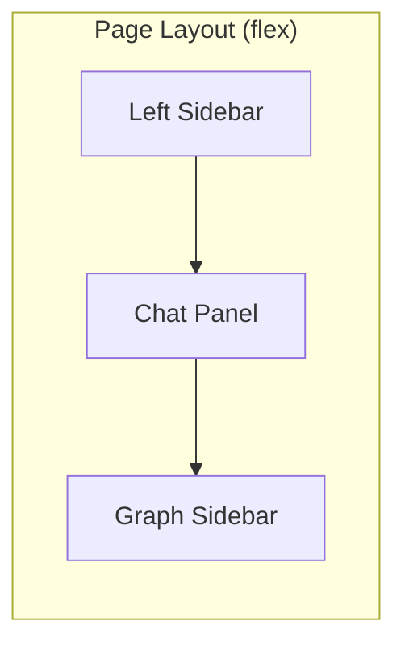

# Design Document: Graph Visualization Layout Restructure

## Overview

This feature restructures the page layout to move the graph visualization from inside the chat panel to a dedicated right sidebar at the page level. The change involves modifying the `ChatPage` component to render the `GraphVisualization` component as a sibling to the chat panel rather than a child, creating a three-column layout: left sidebar (navigation), center (chat panel), and right sidebar (graph visualization).

## Architecture

The restructuring affects the component hierarchy and layout structure:

```
Before:
ChatPage
├── Sidebar (left navigation)
└── Chat Panel Container
    ├── GraphVisualization (inside chat)
    ├── Messages
    └── Input

After:
ChatPage
├── Sidebar (left navigation)
├── Chat Panel Container
│   ├── Messages
│   └── Input
└── GraphVisualization (page-level right sidebar)
```

### Layout Structure



## Components and Interfaces

### ChatPage Layout Changes

The `ChatPage` component will be restructured to use a three-section flex layout:

```typescript
// Simplified structure
<div className="h-screen flex">
  {/* Left Sidebar */}
  <Sidebar />
  
  {/* Main Chat Panel - flex-1 to fill available space */}
  <div className={`flex-1 transition-all duration-300 ${isGraphExpanded ? 'mr-80' : ''}`}>
    <div className="chat-card">
      {/* Messages and Input */}
    </div>
  </div>
  
  {/* Right Sidebar - Graph Visualization */}
  <GraphVisualization />
</div>
```

### GraphVisualization Component Updates

The component already uses fixed positioning. Minor adjustments needed:

```typescript
interface GraphVisualizationProps {
  currentStage: GraphNodeId | null;
  completedStages: GraphNodeId[];
  isExpanded: boolean;
  onToggle: () => void;
}
```

No interface changes required - the component already supports the needed props.

## Data Models

No new data models required. The existing `GraphVisualizationPreferences` in local storage remains unchanged.

## Correctness Properties

*A property is a characteristic or behavior that should hold true across all valid executions of a system-essentially, a formal statement about what the system should do. Properties serve as the bridge between human-readable specifications and machine-verifiable correctness guarantees.*

### Property 1: Graph panel DOM independence

*For any* page render with the graph visualization, the graph panel element SHALL be a sibling to the chat panel container, not a descendant of it.

**Validates: Requirements 1.1, 1.2**

### Property 2: Chat panel width adjustment

*For any* graph panel state (expanded or collapsed), the chat panel container SHALL have appropriate margin/width classes - margin reserved when expanded, full width when collapsed.

**Validates: Requirements 1.3, 1.4**

### Property 3: RTL layout mirroring

*For any* RTL locale, the graph sidebar SHALL have left positioning classes instead of right, and the page layout SHALL use reversed flex direction.

**Validates: Requirements 4.1, 4.2, 4.3**

## Error Handling

| Error Scenario | Handling Strategy |
|----------------|-------------------|
| Transition animation interrupted | CSS transitions handle gracefully |
| Window resize during animation | Flexbox layout auto-adjusts |
| Local storage unavailable | Default to collapsed state (existing behavior) |

## Testing Strategy

### Property-Based Testing

We will use **fast-check** for property-based testing. Each property test will run a minimum of 100 iterations.

Property tests will be tagged with the format: `**Feature: graph-visualization-layout, Property {number}: {property_text}**`

### Unit Tests

Unit tests will cover:
- Layout structure verification (graph panel is sibling to chat panel)
- Width transitions when panel state changes
- RTL positioning behavior

### Test File Structure

Tests will be added to the existing test file:
```
frontend/tests/presentation/graphVisualization.test.tsx
```

