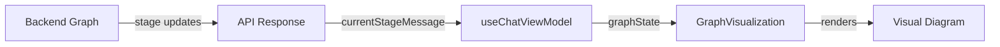

# Design Document: Graph Visualization

## Overview

This feature adds a "Behind the Scenes" visualization panel to the symptom checker chat interface. The panel displays the LangGraph workflow as an interactive diagram, showing users which processing stage they're currently in and helping them understand the diagnostic flow. The visualization updates in real-time as the graph executes, providing transparency into the AI-powered symptom checking process.

## Architecture

The feature follows the existing frontend architecture pattern with a new presentation component and supporting utilities:

```
frontend/
├── presentation/
│   └── GraphVisualization.tsx    # Main visualization component
├── types/
│   └── graph.ts                  # Graph node types and interfaces
├── locales/
│   ├── en.json                   # English translations (extended)
│   └── fa.json                   # Persian translations (extended)
└── viewmodels/
    └── useChatViewModel.ts       # Extended with graph state
```

The backend already provides stage information via `currentStageMessage` in the streaming response. We'll map these stage messages to graph node states.

### Data Flow



## Components and Interfaces

### GraphVisualization Component

The main React component that renders the graph diagram.

```typescript
interface GraphVisualizationProps {
  currentStage: GraphNodeId | null;
  completedStages: GraphNodeId[];
  isExpanded: boolean;
  onToggle: () => void;
}
```

### Graph Node Types

```typescript
type GraphNodeId = 
  | 'generate_questions'
  | 'collect_answers'
  | 'generate_ddx'
  | 'generate_refinement_question'
  | 'collect_refinement_answer'
  | 'refine_ddx'
  | 'generate_final_summary';

type NodeStatus = 'pending' | 'active' | 'completed';

interface GraphNode {
  id: GraphNodeId;
  nameKey: string;        // i18n key for node name
  descriptionKey: string; // i18n key for description
  tooltipKey: string;     // i18n key for detailed tooltip
  status: NodeStatus;
}

interface GraphEdge {
  from: GraphNodeId;
  to: GraphNodeId;
  isConditional?: boolean; // For the refinement loop
}
```

### Graph Configuration

Static configuration defining the graph structure:

```typescript
const GRAPH_NODES: GraphNode[] = [
  { id: 'generate_questions', nameKey: 'graph.nodes.generateQuestions.name', ... },
  { id: 'collect_answers', nameKey: 'graph.nodes.collectAnswers.name', ... },
  { id: 'generate_ddx', nameKey: 'graph.nodes.generateDdx.name', ... },
  { id: 'generate_refinement_question', nameKey: 'graph.nodes.refinementQuestion.name', ... },
  { id: 'collect_refinement_answer', nameKey: 'graph.nodes.collectRefinementAnswer.name', ... },
  { id: 'refine_ddx', nameKey: 'graph.nodes.refineDdx.name', ... },
  { id: 'generate_final_summary', nameKey: 'graph.nodes.finalSummary.name', ... },
];

const GRAPH_EDGES: GraphEdge[] = [
  { from: 'generate_questions', to: 'collect_answers' },
  { from: 'collect_answers', to: 'generate_ddx' },
  { from: 'generate_ddx', to: 'generate_refinement_question' },
  { from: 'generate_refinement_question', to: 'collect_refinement_answer' },
  { from: 'collect_refinement_answer', to: 'refine_ddx' },
  { from: 'refine_ddx', to: 'generate_refinement_question', isConditional: true },
  { from: 'generate_refinement_question', to: 'generate_final_summary', isConditional: true },
];
```

## Data Models

### Stage Mapping

Map backend stage messages to graph node IDs:

```typescript
const STAGE_TO_NODE_MAP: Record<string, GraphNodeId> = {
  'Generating questions...': 'generate_questions',
  'Waiting for answers...': 'collect_answers',
  'Analyzing symptoms...': 'generate_ddx',
  'Generating follow-up...': 'generate_refinement_question',
  'Waiting for response...': 'collect_refinement_answer',
  'Refining diagnosis...': 'refine_ddx',
  'Preparing summary...': 'generate_final_summary',
};
```

### Local Storage Schema

```typescript
interface GraphVisualizationPreferences {
  isExpanded: boolean;
}

// Storage key: 'graph_visualization_prefs'
```

## Correctness Properties

*A property is a characteristic or behavior that should hold true across all valid executions of a system-essentially, a formal statement about what the system should do. Properties serve as the bridge between human-readable specifications and machine-verifiable correctness guarantees.*

### Property 1: Toggle round-trip preserves state

*For any* initial panel state (expanded or collapsed), toggling the panel twice SHALL return it to the original state.

**Validates: Requirements 1.2, 1.3**

### Property 2: Panel state persistence round-trip

*For any* panel state change, reading from local storage after the change SHALL return the same state that was set.

**Validates: Requirements 1.4**

### Property 3: Node content rendering completeness

*For any* graph node in the configuration, the rendered output SHALL contain both the node's translated name and description.

**Validates: Requirements 2.2**

### Property 4: Node status styling consistency

*For any* node and *for any* status (pending, active, completed), the rendered node SHALL have a CSS class or attribute that corresponds to that status.

**Validates: Requirements 3.1, 3.2, 3.3**

### Property 5: Active node status message correspondence

*For any* active node, the status message displayed below the graph SHALL correspond to that node's action description.

**Validates: Requirements 4.3**

### Property 6: Persian locale node text translation

*For any* graph node when the locale is Persian, the rendered node name and description SHALL be in Persian (non-ASCII characters present).

**Validates: Requirements 6.1**

## Error Handling

| Error Scenario | Handling Strategy |
|----------------|-------------------|
| Unknown stage message from backend | Display generic "Processing..." status, log warning |
| Local storage unavailable | Default to collapsed state, skip persistence |
| Missing translation key | Fall back to English translation |
| Invalid node status | Default to 'pending' status |

## Testing Strategy

### Property-Based Testing

We will use **fast-check** for property-based testing in TypeScript/JavaScript. Each property test will run a minimum of 100 iterations.

Property tests will be tagged with the format: `**Feature: graph-visualization, Property {number}: {property_text}**`

### Unit Tests

Unit tests will cover:
- Component rendering with various props combinations
- Stage-to-node mapping function
- Local storage read/write operations
- Tooltip display on hover/tap interactions

### Test File Structure

```
frontend/tests/
├── presentation/
│   └── graphVisualization.test.tsx
└── utils/
    └── graphHelpers.test.ts
```
