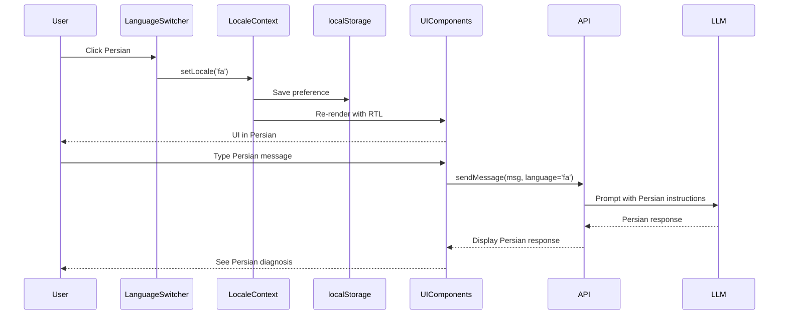

# Design Document: Persian Localization

## Overview

This design document outlines the implementation of Persian (Farsi) language support for the Medical Chatbot application. The solution provides a comprehensive localization system supporting RTL layouts, Persian translations, localized date/number formatting, and Persian AI responses.

## Architecture

The localization system follows a layered approach that integrates with the existing MVVM architecture:

```
┌─────────────────────────────────────────────────────────────┐
│                      Frontend                                │
├─────────────────────────────────────────────────────────────┤
│  ┌─────────────┐  ┌─────────────┐  ┌─────────────────────┐ │
│  │ LocaleCtx   │  │ useLocale   │  │ Translation Files   │ │
│  │ (Provider)  │──│ (Hook)      │──│ (en.json, fa.json)  │ │
│  └─────────────┘  └─────────────┘  └─────────────────────┘ │
│         │                │                                   │
│         ▼                ▼                                   │
│  ┌─────────────────────────────────────────────────────────┐│
│  │              UI Components (RTL-aware)                  ││
│  │  ChatPage, Sidebar, MessageBubble, LanguageSwitcher     ││
│  └─────────────────────────────────────────────────────────┘│
├─────────────────────────────────────────────────────────────┤
│                      Backend                                 │
├─────────────────────────────────────────────────────────────┤
│  ┌─────────────────────────────────────────────────────────┐│
│  │         SymptomCheckerProvider (Language-aware)         ││
│  │  - System prompts include language context              ││
│  │  - Responses generated in user's preferred language     ││
│  └─────────────────────────────────────────────────────────┘│
└─────────────────────────────────────────────────────────────┘
```

## Components and Interfaces

### Frontend Components

#### 1. LocaleContext (`frontend/contexts/LocaleContext.tsx`)

React context providing locale state and utilities throughout the application.

```typescript
interface LocaleContextValue {
  locale: 'en' | 'fa';
  direction: 'ltr' | 'rtl';
  setLocale: (locale: 'en' | 'fa') => void;
  t: (key: string, params?: Record<string, string>) => string;
  formatDate: (date: Date | string) => string;
  formatNumber: (num: number) => string;
  formatPercent: (num: number) => string;
}
```

#### 2. useLocale Hook (`frontend/hooks/useLocale.ts`)

Custom hook for accessing locale context with type safety.

```typescript
function useLocale(): LocaleContextValue;
```

#### 3. LanguageSwitcher Component (`frontend/presentation/LanguageSwitcher.tsx`)

UI component for switching between languages.

```typescript
interface LanguageSwitcherProps {
  className?: string;
}
```

#### 4. Translation Files

```
frontend/locales/
├── en.json    # English translations
└── fa.json    # Persian translations
```

Translation file structure:
```typescript
interface Translations {
  common: {
    send: string;
    cancel: string;
    loading: string;
    error: string;
  };
  chat: {
    placeholder: string;
    newChat: string;
    chatHistory: string;
    noConversations: string;
  };
  medical: {
    answerQuestions: string;
    submitAnswers: string;
    diagnosis: string;
    confidence: string;
  };
  errors: {
    storageUnavailable: string;
    sessionExpired: string;
    sendFailed: string;
  };
}
```

### Backend Components

#### 1. Language-Aware Prompts (`backend/src/infrastructure/symptom_checker_graph.py`)

System prompts will be modified to include language context:

```python
def get_localized_prompt(base_prompt: str, language: str) -> str:
    """Add language instruction to system prompt."""
    if language == 'fa':
        return f"{base_prompt}\n\nIMPORTANT: Respond entirely in Persian (Farsi). Use appropriate Persian medical terminology."
    return base_prompt
```

#### 2. Request DTO Update (`backend/src/application/dtos.py`)

```python
class SendMessageRequest(BaseModel):
    conversation_id: UUID | None = None
    message: str = Field(..., min_length=1)
    conversation_history: Optional[List[HistoryMessage]] = None
    language: str = Field(default='en', description="User's preferred language: 'en' or 'fa'")
```

## Data Models

### Locale Storage (localStorage)

```typescript
interface LocalePreference {
  locale: 'en' | 'fa';
  persianNumerals: boolean;  // Whether to use ۰۱۲۳۴۵۶۷۸۹
  savedAt: string;           // ISO timestamp
}
```

### Message with Locale Context

The existing Message type remains unchanged. Language context is passed via API requests, not stored per-message.

## Correctness Properties

*A property is a characteristic or behavior that should hold true across all valid executions of a system-essentially, a formal statement about what the system should do. Properties serve as the bridge between human-readable specifications and machine-verifiable correctness guarantees.*

### Property 1: Translation completeness
*For any* translation key that exists in the English translation file, the Persian translation file SHALL contain a corresponding entry (or the system falls back to English).
**Validates: Requirements 7.2**

### Property 2: Language preference persistence round-trip
*For any* valid locale value ('en' or 'fa'), saving the preference and then retrieving it SHALL return the same locale value.
**Validates: Requirements 1.4**

### Property 3: RTL direction consistency
*For any* UI component rendered with Persian locale active, the computed text direction SHALL be 'rtl'.
**Validates: Requirements 2.1**

### Property 4: Persian numeral conversion
*For any* non-negative integer and Persian locale with Persian numerals enabled, the formatted output SHALL contain only Persian digit characters (۰-۹).
**Validates: Requirements 4.2**

### Property 5: Date formatting locale consistency
*For any* valid Date object and Persian locale, the formatted date string SHALL contain Persian month names or localized format.
**Validates: Requirements 4.1**

### Property 6: Persian text preservation round-trip
*For any* string containing Persian characters, submitting it as a message and retrieving it SHALL preserve all Persian characters exactly.
**Validates: Requirements 6.2**

### Property 7: Language change reactivity
*For any* translation key, changing the locale SHALL immediately update the value returned by the translation function without page reload.
**Validates: Requirements 5.3, 5.4**

### Property 8: System prompt language inclusion
*For any* request with language='fa', the system prompt sent to the LLM SHALL contain Persian language instructions.
**Validates: Requirements 3.4**

## Error Handling

| Error Scenario | Handling Strategy |
|----------------|-------------------|
| Missing translation key | Fall back to English translation |
| Invalid locale value | Default to 'en' |
| localStorage unavailable | Use in-memory state, warn user |
| Persian font not loaded | Use system fallback fonts |
| LLM responds in wrong language | Display response as-is (best effort) |

## Testing Strategy

### Unit Tests

1. **Translation function tests**
   - Verify all keys return non-empty strings
   - Verify parameter interpolation works
   - Verify fallback to English for missing keys

2. **Formatting function tests**
   - Date formatting for both locales
   - Number formatting with Persian numerals
   - Percentage formatting

3. **RTL utility tests**
   - Direction detection based on locale
   - CSS class generation for RTL

### Property-Based Tests

The following properties will be tested using fast-check:

1. **Translation completeness** - Generate random keys from English file, verify Persian has them or fallback works
2. **Locale persistence round-trip** - Save/retrieve locale preference
3. **Persian numeral conversion** - Convert arbitrary numbers, verify output contains only Persian digits
4. **Persian text preservation** - Submit/retrieve Persian strings, verify character preservation

### Integration Tests

1. **Language switcher flow** - Click switcher, select language, verify UI updates
2. **Chat with Persian** - Send Persian message, verify display and storage
3. **RTL layout** - Verify sidebar position and message alignment in Persian mode

## Implementation Notes

### RTL CSS Strategy

Use Tailwind CSS logical properties and RTL plugin:

```css
/* Use logical properties that automatically flip for RTL */
.message-bubble {
  margin-inline-start: auto;  /* Instead of margin-left */
  padding-inline-end: 1rem;   /* Instead of padding-right */
}

/* RTL-specific overrides */
[dir="rtl"] .sidebar {
  /* Sidebar on right in RTL */
}
```

### Font Support

Add Persian-compatible fonts to the application:

```css
@font-face {
  font-family: 'Vazirmatn';
  src: url('/fonts/Vazirmatn-Regular.woff2') format('woff2');
  font-weight: normal;
}

body[data-locale="fa"] {
  font-family: 'Vazirmatn', 'Tahoma', sans-serif;
}
```

### API Language Parameter

The frontend will include the user's language preference in API requests:

```typescript
// In api.ts
async sendMessageStream(request: SendMessageRequest, locale: string) {
  const requestBody = {
    ...request,
    language: locale,
  };
  // ...
}
```

## Mermaid Diagram: Locale Flow


