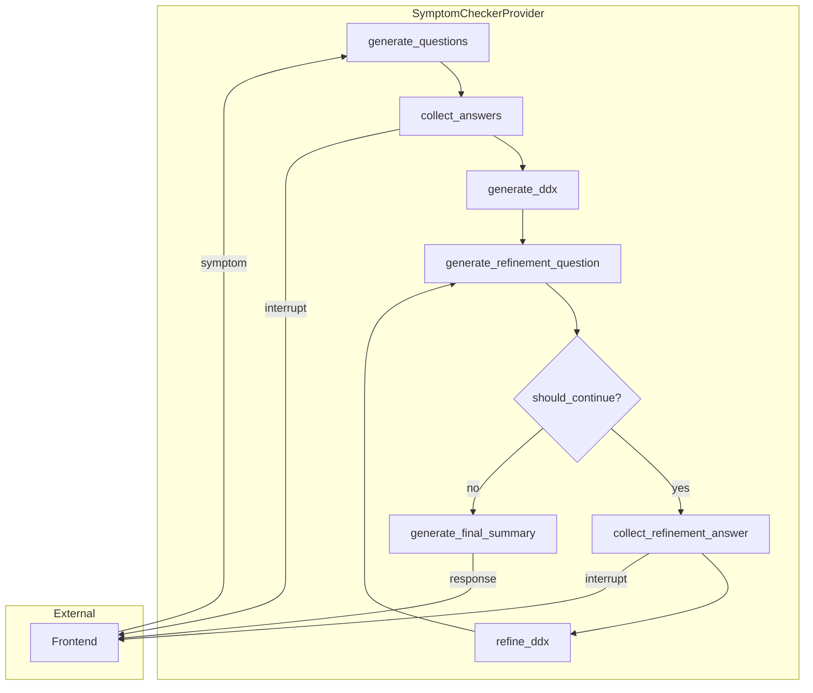

# Design Document: Symptom Checker Provider

## Overview

This design describes the implementation of a new `SymptomCheckerProvider` that replaces the existing `MedicalChatbotV2Provider`. The new provider implements a sophisticated medical triage workflow using LangGraph with:

- Structured preliminary screening questions generation
- LLM-based free-text answer extraction
- Differential diagnosis with severity classification
- Iterative refinement loop with intelligent stop conditions
- Human-in-the-loop interrupts for answer collection

The provider integrates with the existing clean architecture by implementing the `ILLMProvider` interface and using SQLite-based checkpointing for state persistence.

## Architecture



The workflow follows a linear path with a refinement loop:
1. **Question Generation**: Creates 3-5 screening questions based on symptoms
2. **Answer Collection**: Interrupts for user input, extracts answers from free-text
3. **DDX Generation**: Produces ranked differential diagnosis
4. **Refinement Loop**: Iteratively asks follow-up questions until confident
5. **Final Summary**: Generates patient-friendly summary

## Components and Interfaces

### SymptomCheckerProvider Class

```python
class SymptomCheckerProvider(ILLMProvider):
    """Medical symptom checker using LangGraph workflow."""
    
    def __init__(self, api_key: str, checkpoint_db_path: str = "checkpoints.db"):
        """Initialize with OpenAI API key and checkpoint database path."""
        
    async def generate_response(self, messages: List[dict], thread_id: Optional[str] = None) -> str:
        """Generate non-streaming response."""
        
    async def generate_response_stream(
        self, messages: List[dict], thread_id: Optional[str] = None
    ) -> AsyncIterator[str]:
        """Generate streaming response with interrupt support."""
        
    async def resume(self, thread_id: str, user_input: str) -> Dict[str, Any]:
        """Resume interrupted conversation with user's answer."""
```

### Pydantic Models (Structured Outputs)

| Model | Purpose | Fields |
|-------|---------|--------|
| `Question` | Single screening question | question, purpose, options: List[str] |
| `PreliminaryQuestions` | Collection of questions | preliminary_questions: List[Question] |
| `Diagnosis` | Single diagnosis entry | condition, probability, reasoning, severity |
| `DifferentialDiagnosis` | Full DDX | differential: List[Diagnosis], disclaimer |
| `QAPair` | Question-answer pair | question, answer |
| `ExtractedAnswers` | Extracted Q&A | qa_pairs: List[QAPair] |
| `RefinementQuestion` | Follow-up question | question, purpose, options: List[str] |
| `FinalSummary` | Patient summary | top_diagnosis, probability, explanation, disclaimer |

**Note**: Options are generated via **Pydantic structured output** - the schema defines the `options` field and the LLM fills it automatically:

```python
class Question(BaseModel):
    """A single screening question with answer options."""
    question: str = Field(description="The question text to ask the patient")
    purpose: str = Field(description="Why this question helps with diagnosis")
    options: list[str] = Field(
        description="2-4 contextually relevant answer options for the patient to choose from"
    )

# Usage: model.with_structured_output(PreliminaryQuestions)
```

The LLM generates contextually relevant options based on the question:
- "How long have you had this headache?" → ["Less than a day", "1-3 days", "About a week", "More than a week"]
- "Is the pain constant or intermittent?" → ["Constant", "Comes and goes", "Only at certain times"]
- "Do you have a fever?" → ["Yes", "No", "I haven't checked"]

No prompt engineering needed for options - the schema drives the output structure.

### Graph State

```python
class SymptomCheckerState(TypedDict):
    messages: Annotated[list[AnyMessage], add_messages]
    symptom_input: str
    preliminary_questions: PreliminaryQuestions | None
    qa_pairs: list[dict] | None
    differential_diagnosis: DifferentialDiagnosis | None
    refinement_qa_pairs: list[dict] | None
    current_refinement_question: str | None
    refined_ddx: DifferentialDiagnosis | None
    refinement_count: int
    final_summary: FinalSummary | None
```

## Data Models

### Severity Classification Enum

```python
SeverityLevel = Literal["life_threatening", "serious", "moderate", "mild"]
```

### Interrupt Response Format

For frontend compatibility, interrupts are encoded using the existing `__OPTIONS__` format. Each question includes clickable answer options.

**Single Question with Options** (used for refinement and sequential preliminary questions):
```
{question_text}
__OPTIONS__:["Option 1", "Option 2", "Option 3"]
```

**Interrupt Payload Structure**:
```json
{
  "type": "interrupt",
  "question": "How long have you had this symptom?",
  "options": ["Less than a day", "1-3 days", "More than a week"],
  "thread_id": "uuid"
}
```

**Question Flow**: Instead of presenting all preliminary questions at once, the system asks them one at a time with options. This provides a better UX similar to the current V2 provider:

1. First preliminary question → user selects option or types answer
2. Second preliminary question → user selects option or types answer
3. ... (continues for all 3-5 questions)
4. Generate DDX
5. Refinement question with options → user responds
6. ... (refinement loop until stop conditions)

## Correctness Properties

*A property is a characteristic or behavior that should hold true across all valid executions of a system-essentially, a formal statement about what the system should do. Properties serve as the bridge between human-readable specifications and machine-verifiable correctness guarantees.*

### Property 1: Question count bounds
*For any* symptom input string, the generated PreliminaryQuestions SHALL contain between 3 and 5 questions (inclusive).
**Validates: Requirements 1.1**

### Property 2: Single question validation
*For any* generated Question (preliminary or refinement), the question text SHALL contain exactly one question mark and SHALL NOT contain conjunctions like "and also" or "as well as" that combine multiple questions.
**Validates: Requirements 1.2, 3.2**

### Property 3: Question structure completeness
*For any* generated Question, the question field, purpose field, and options field SHALL all be non-empty, with options containing 2-4 items.
**Validates: Requirements 1.3, 1.4**

### Property 4: Options generation
*For any* generated Question, the LLM SHALL generate 2-4 contextually relevant answer options alongside the question text in a single structured output call.
**Validates: Requirements 1.4**

### Property 5: DDX structure validity
*For any* generated DifferentialDiagnosis, each Diagnosis SHALL have: probability in range [0.0, 1.0], non-empty reasoning, and severity in {"life_threatening", "serious", "moderate", "mild"}.
**Validates: Requirements 2.2, 2.3**

### Property 6: DDX ranking order
*For any* generated DifferentialDiagnosis with multiple conditions, the differential list SHALL be sorted by probability in descending order.
**Validates: Requirements 2.1**

### Property 7: DDX disclaimer presence
*For any* generated DifferentialDiagnosis, the disclaimer field SHALL be a non-empty string containing "educational purposes" or similar disclaimer text.
**Validates: Requirements 2.4**

### Property 8: Refinement stop condition - confidence
*For any* state where life-threatening probabilities sum to less than 0.10 AND top diagnosis probability exceeds 0.50, the should_continue_refinement function SHALL return "end".
**Validates: Requirements 4.1**

### Property 9: Refinement stop condition - max iterations
*For any* state where refinement_count >= 5, the should_continue_refinement function SHALL return "end" regardless of probability values.
**Validates: Requirements 4.2**

### Property 10: Final summary completeness
*For any* generated FinalSummary, all fields (top_diagnosis, probability, explanation, disclaimer) SHALL be non-empty, and probability SHALL be in range [0.0, 1.0].
**Validates: Requirements 4.3**

### Property 11: Options encoding format
*For any* interrupt response with options, the encoded string SHALL match the pattern `{text}\n__OPTIONS__:{json_array}` where json_array is valid JSON.
**Validates: Requirements 5.2**

### Property 12: Checkpoint round-trip preservation
*For any* conversation that is interrupted and then resumed, the state after resume SHALL contain all QA_Pairs and differential_diagnosis data that existed before the interrupt.
**Validates: Requirements 7.2, 7.3**

## Error Handling

| Error Condition | Handling Strategy |
|-----------------|-------------------|
| Empty symptom input | Return greeting message prompting for symptoms |
| LLM API failure | Raise `LLMProviderException` with descriptive message |
| Checkpoint not found | Raise `CheckpointNotFoundException` (404 to frontend) |
| Invalid structured output | Retry once, then raise exception |
| Max refinements reached | Gracefully exit loop, generate summary |

## Testing Strategy

### Dual Testing Approach

This implementation uses both unit tests and property-based tests:

- **Unit tests**: Verify specific examples, edge cases, and integration points
- **Property-based tests**: Verify universal properties hold across all valid inputs

### Property-Based Testing Framework

**Library**: `hypothesis` (Python)
**Minimum iterations**: 100 per property test

### Test Categories

1. **Structural Properties** (Properties 1-7, 10-11)
   - Test that generated outputs conform to expected structure
   - Use hypothesis strategies to generate varied inputs
   
2. **Behavioral Properties** (Properties 8-9)
   - Test routing logic with generated state combinations
   - Verify stop conditions are correctly evaluated

3. **Round-Trip Properties** (Property 12)
   - Test checkpoint save/restore preserves state
   - Verify interrupt/resume cycle maintains data integrity

### Test Annotations

Each property-based test MUST include a comment in this format:
```python
# **Feature: symptom-checker-provider, Property {number}: {property_text}**
```

### Unit Test Coverage

- Node function outputs (generate_questions, generate_ddx, etc.)
- Edge cases (empty input, single condition DDX, max iterations)
- Integration with ILLMProvider interface
- Checkpoint persistence and retrieval
