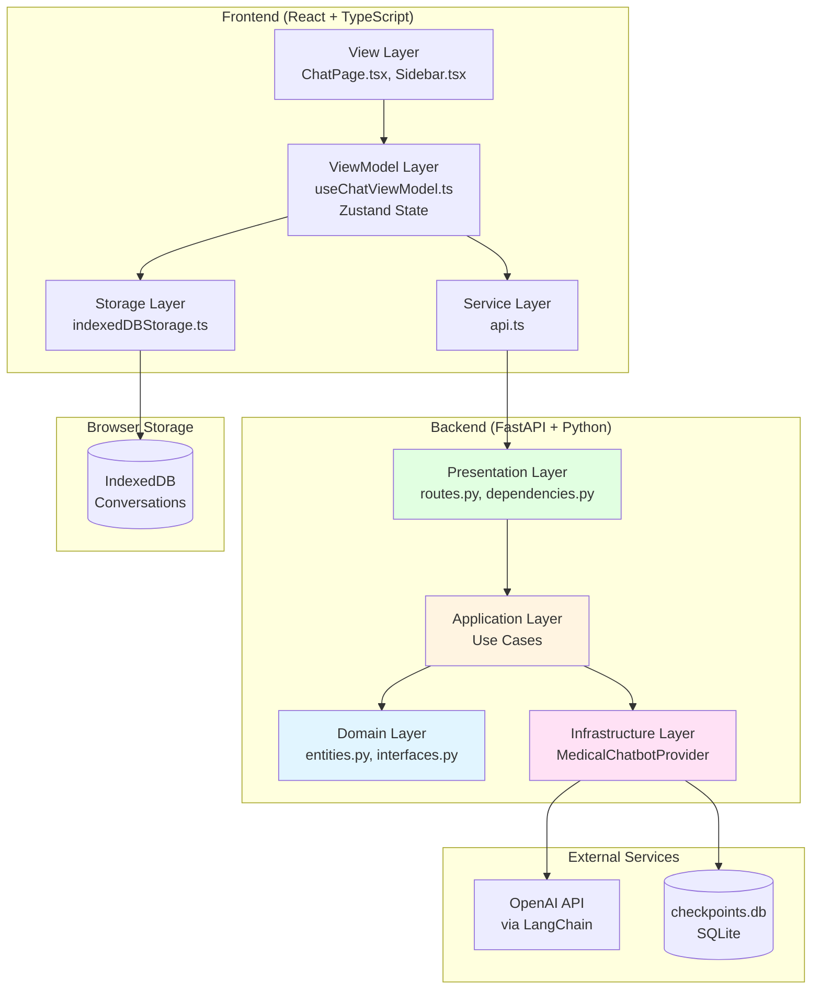
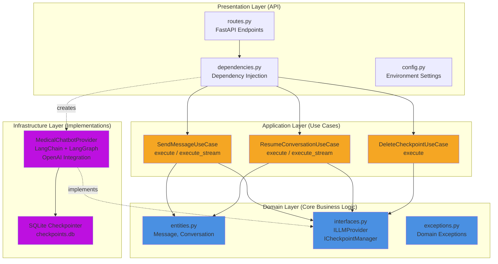
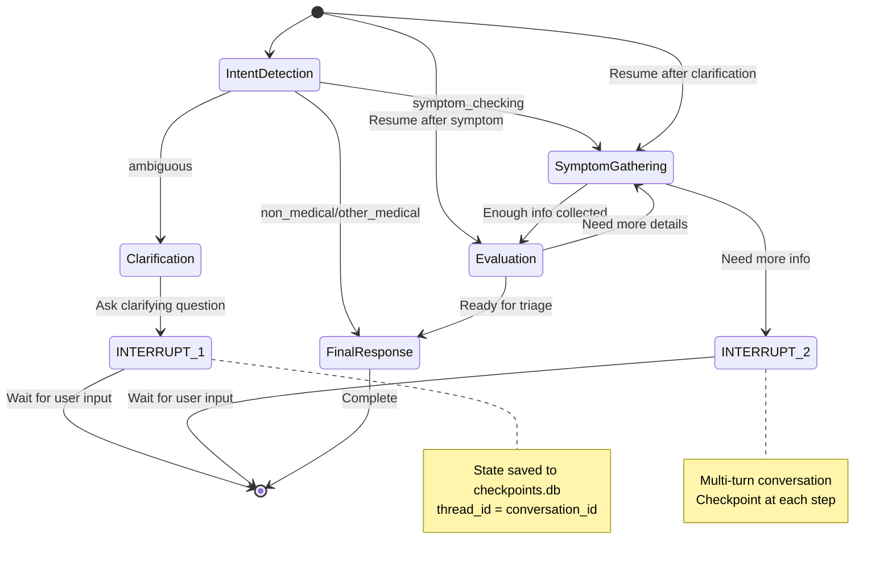
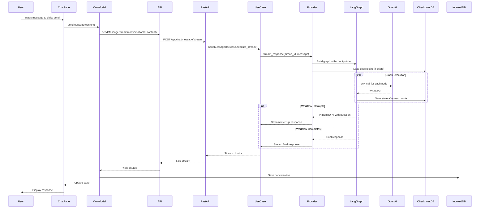
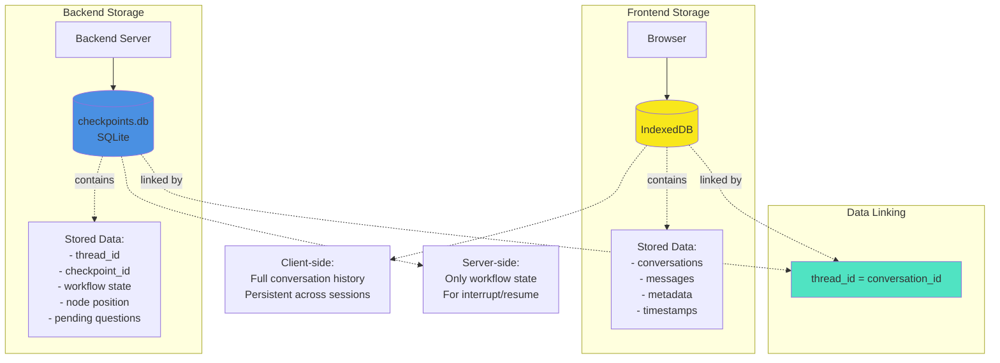
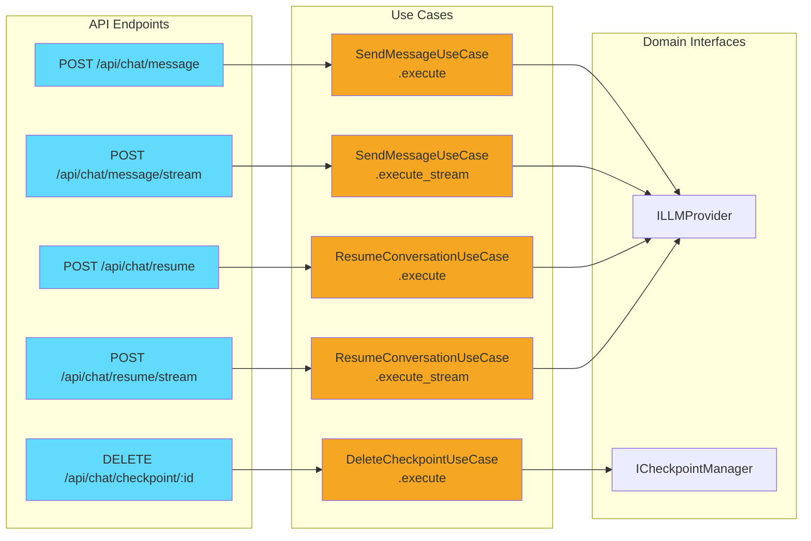
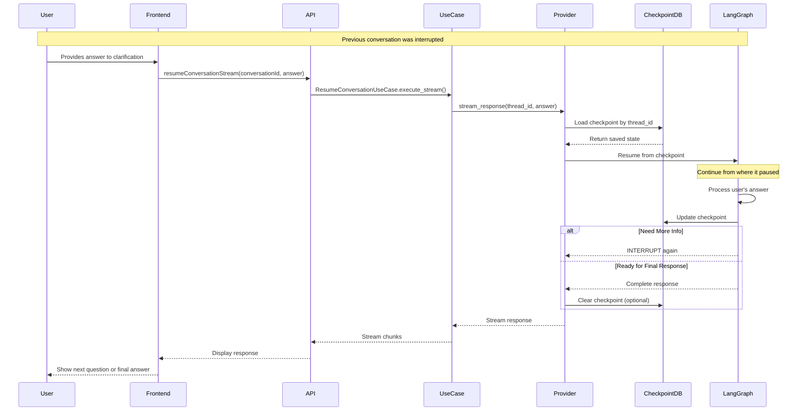
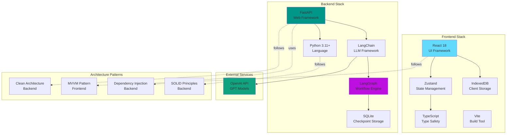

# Architecture Diagrams

## 1. System Overview - Clean Architecture Layers



## 2. Backend Layer Architecture (Clean Architecture)



## 3. Frontend Architecture (MVVM Pattern)

```mermaid
graph TB
    subgraph "View Layer"
        ChatPage[ChatPage.tsx<br/>Main Chat Interface]
        Sidebar[Sidebar.tsx<br/>Conversation List]
        Components[Other Components<br/>MessageBubble, etc.]
    end
    
    subgraph "ViewModel Layer"
        ViewModel[useChatViewModel.ts<br/>Zustand Store]
        State[State Management<br/>- conversations<br/>- currentConversation<br/>- messages<br/>- isLoading]
        Actions[Actions<br/>- sendMessage<br/>- resumeConversation<br/>- createConversation<br/>- deleteConversation]
    end
    
    subgraph "Service Layer"
        API[api.ts<br/>HTTP Client]
        Methods[API Methods<br/>- sendMessageStream<br/>- resumeConversationStream<br/>- deleteCheckpoint]
    end
    
    subgraph "Storage Layer"
        IDB[indexedDBStorage.ts<br/>IndexedDB Wrapper]
        Operations[Operations<br/>- saveConversation<br/>- getConversations<br/>- deleteConversation]
    end
    
    subgraph "Types"
        Types[index.ts<br/>TypeScript Interfaces<br/>Message, Conversation, etc.]
    end
    
    ChatPage --> ViewModel
    Sidebar --> ViewModel
    Components --> ViewModel
    
    ViewModel --> State
    ViewModel --> Actions
    
    Actions --> API
    Actions --> IDB
    
    API --> Methods
    IDB --> Operations
    
    State -.uses.-> Types
    API -.uses.-> Types
    IDB -.uses.-> Types
    
    style ChatPage fill:#61dafb
    style Sidebar fill:#61dafb
    style ViewModel fill:#764abc
    style API fill:#50e3c2
    style IDB fill:#f8e71c
```

## 4. LangGraph Medical Workflow State Machine



## 5. Data Flow: Send Message (Complete Journey)



## 6. Data Persistence Architecture



## 7. SOLID Principles Implementation

```mermaid
graph TB
    subgraph "Single Responsibility"
        SR1[SendMessageUseCase<br/>Only handles sending messages]
        SR2[MedicalChatbotProvider<br/>Only handles LLM interaction]
        SR3[indexedDBStorage<br/>Only handles storage]
    end
    
    subgraph "Open/Closed"
        OC1[ILLMProvider Interface]
        OC2[MedicalChatbotProvider]
        OC3[Future: GPT4Provider]
        OC4[Future: ClaudeProvider]
        
        OC2 -.implements.-> OC1
        OC3 -.implements.-> OC1
        OC4 -.implements.-> OC1
    end
    
    subgraph "Liskov Substitution"
        LS1[Use Case depends on ILLMProvider]
        LS2[Any implementation works]
        LS3[Behavior preserved]
        
        LS1 --> LS2 --> LS3
    end
    
    subgraph "Interface Segregation"
        IS1[ILLMProvider<br/>stream_response, get_response]
        IS2[ICheckpointManager<br/>delete_checkpoint]
        IS3[Small, focused interfaces]
        
        IS1 --> IS3
        IS2 --> IS3
    end
    
    subgraph "Dependency Inversion"
        DI1[Use Cases]
        DI2[Abstractions<br/>ILLMProvider, ICheckpointManager]
        DI3[Implementations<br/>MedicalChatbotProvider]
        
        DI1 --> DI2
        DI3 -.implements.-> DI2
    end
    
    style SR1 fill:#4a90e2
    style OC1 fill:#f5a623
    style LS1 fill:#50e3c2
    style IS1 fill:#bd10e0
    style DI2 fill:#7ed321
```



## 8. API Endpoints & Use Cases Mapping



## 9. Component Interaction: Resume Conversation Flow



## 10. Technology Stack Overview



---

## Key Insights from Diagrams

### Architecture Strengths
1. **Clear Separation of Concerns**: Each layer has distinct responsibilities
2. **Testability**: Domain logic isolated from infrastructure
3. **Flexibility**: Easy to swap LLM providers or storage mechanisms
4. **Scalability**: Stateless backend with client-side storage

### Data Flow Patterns
1. **Streaming**: Real-time response delivery via SSE
2. **Interrupts**: Workflow pauses for user input, resumes seamlessly
3. **Dual Storage**: Client stores history, server stores workflow state

### Design Patterns Used
- **Clean Architecture** (Backend)
- **MVVM** (Frontend)
- **Dependency Injection** (Backend)
- **Repository Pattern** (Storage abstraction)
- **State Machine** (LangGraph workflow)
- **Strategy Pattern** (Swappable LLM providers)
