# Medical Reasoning Flow - Symptom Checker Agent

This document describes the **logical medical reasoning process** the AI agent follows, independent of technical implementation.

---

## 🏥 Overview: Clinical Decision-Making Process

The agent follows a structured clinical reasoning approach similar to how a physician would triage a patient:

1. **Initial Assessment** - Gather basic symptom information
2. **Systematic Inquiry** - Ask focused screening questions
3. **Differential Diagnosis** - Generate list of possible conditions
4. **Iterative Refinement** - Narrow down through targeted questions
5. **Clinical Summary** - Provide patient-friendly assessment

---

## 📊 Logical Flow Diagram

```mermaid
graph TB
    Start([Patient Reports Symptom]) --> Phase1[PHASE 1: INITIAL SCREENING]
    
    Phase1 --> Q1[Generate 3-5 Screening Questions]
    Q1 --> Q1Details[Questions cover:<br/>• Onset & Duration<br/>• Severity<br/>• Associated Symptoms<br/>• Relevant History]
    Q1Details --> Collect[Collect All Answers at Once]
    
    Collect --> Phase2[PHASE 2: INITIAL DIAGNOSIS]
    
    Phase2 --> DDX1[Generate Differential Diagnosis]
    DDX1 --> DDX1Details[For each condition:<br/>• Probability 0-100%<br/>• Clinical Reasoning<br/>• Severity Level<br/>• Ranked by Likelihood]
    
    DDX1Details --> Analyze[Analyze Top 3 Conditions]
    Analyze --> AnalyzeDetails[• Calculate probability gaps<br/>• Identify distinguishing features<br/>• Note red flags]
    
    AnalyzeDetails --> Phase3[PHASE 3: REFINEMENT LOOP]
    
    Phase3 --> Step1{STEP 1:<br/>Probability Gap Analysis}
    
    Step1 -->|Gap > 15%| HighConf[Top Diagnosis<br/>Clearly Stands Out]
    Step1 -->|Gap ≤ 15%| Step2{STEP 2:<br/>Question Utility Analysis}
    
    Step2 -->|History can help| Step3[STEP 3:<br/>Maximum Discrimination<br/>Question Selection]
    Step2 -->|Tests/Imaging needed| TestsNeeded[Identify Required:<br/>• Lab tests<br/>• Imaging<br/>• Physical exam]
    
    Step3 --> AskQ[Ask ONE Targeted Question]
    AskQ --> AskQDetails[Question targets:<br/>• Highest information gain<br/>• Differentiates top 2-3 conditions<br/>• Clear answer options]
    
    AskQDetails --> GetAnswer[Collect Patient Answer]
    GetAnswer --> UpdateDDX[Update Differential Diagnosis]
    UpdateDDX --> CheckLoop{Check Stop Conditions}
    
    CheckLoop -->|Max 5 iterations reached| Stop
    CheckLoop -->|Tests needed| Stop
    CheckLoop -->|High confidence| Stop
    CheckLoop -->|Continue| Step1
    
    HighConf --> Stop[STOP REFINEMENT]
    TestsNeeded --> Stop
    
    Stop --> Phase4[PHASE 4: FINAL SUMMARY]
    
    Phase4 --> Summary[Generate Patient-Friendly Summary]
    Summary --> SummaryDetails[Include:<br/>• Most likely diagnosis<br/>• Confidence level<br/>• Explanation<br/>• Next steps<br/>• Disclaimer]
    
    SummaryDetails --> ConfLevel{Confidence Level?}
    
    ConfLevel -->|High<br/>Prob > 60% & Gap > 15%| HighMsg["Based on your symptoms,<br/>[condition] is the most<br/>likely diagnosis"]
    ConfLevel -->|Moderate<br/>Prob 40-60% or Gap 10-15%| ModMsg["Your symptoms are most<br/>consistent with [condition],<br/>though other possibilities exist"]
    ConfLevel -->|Lower<br/>Prob < 40% or Gap < 10%| LowMsg["Several conditions could<br/>explain your symptoms"]
    
    HighMsg --> Recommend[Provide Recommendations]
    ModMsg --> Recommend
    LowMsg --> Recommend
    
    Recommend --> RecommendDetails[• Specific tests if needed<br/>• When to seek care<br/>• Self-care measures<br/>• Warning signs]
    
    RecommendDetails --> End([Assessment Complete])
    
    style Phase1 fill:#e1f5ff
    style Phase2 fill:#fff4e1
    style Phase3 fill:#ffe1f5
    style Phase4 fill:#e1ffe1
    style Step1 fill:#ffd700
    style Step2 fill:#ffd700
    style Step3 fill:#ffd700
```



---

## 🔍 Detailed Reasoning Process

### **PHASE 1: Initial Screening**

**Goal:** Gather essential baseline information

**Process:**
1. Patient reports initial symptom (e.g., "I have a severe headache")
2. Agent generates 3-5 focused screening questions covering:
   - **Onset:** When did it start? How did it begin?
   - **Duration:** How long has it lasted?
   - **Severity:** How bad is it? (scale, impact on daily life)
   - **Associated symptoms:** Any other symptoms?
   - **Context:** What makes it better/worse?

**Example Questions:**
- "When did the headache start?"
  - Options: Less than 1 hour ago, 1-6 hours ago, 6-24 hours ago, More than 1 day ago
- "How would you rate the pain severity?"
  - Options: Mild (1-3/10), Moderate (4-6/10), Severe (7-9/10), Worst pain ever (10/10)
- "Is the pain on one side or both sides?"
  - Options: One side only, Both sides, Moves around, Behind the eyes

---

### **PHASE 2: Initial Differential Diagnosis**

**Goal:** Generate ranked list of possible conditions

**Clinical Reasoning:**
1. **Pattern Recognition:** Match symptom pattern to known conditions
2. **Probability Assignment:** Estimate likelihood based on:
   - Symptom characteristics
   - Epidemiology (common vs rare)
   - Patient history
   - Red flags

3. **Top 3 Focus:** Deep analysis of most likely conditions
   - Detailed reasoning for each
   - Key distinguishing features
   - What differentiates them from each other

4. **Severity Classification:**
   - **Life-threatening:** Immediate danger (e.g., stroke, meningitis)
   - **Serious:** Prompt care needed (e.g., temporal arteritis)
   - **Moderate:** Medical evaluation needed (e.g., sinusitis)
   - **Mild:** Self-limiting (e.g., tension headache)

**Example Output:**
```
1. Migraine - 60% probability (moderate)
   Reasoning: Unilateral, throbbing, photophobia, nausea
   
2. Tension Headache - 25% probability (mild)
   Reasoning: Bilateral, pressure-like, stress-related
   
3. Cluster Headache - 10% probability (serious)
   Reasoning: Severe unilateral, but lacks autonomic symptoms
   
4. Sinusitis - 5% probability (moderate)
   Reasoning: Facial pressure, but no nasal symptoms reported
```

**Probability Gap Analysis:**
- Gap between #1 and #2: 35 percentage points
- Top diagnosis clearly stands out → High confidence

---

### **PHASE 3: Iterative Refinement Loop**

**Goal:** Narrow down diagnosis through targeted questioning

#### **STEP 1: Probability Gap Analysis**

**Decision Logic:**
```
IF (top_probability - second_probability) > 15%:
    → Top diagnosis clearly stands out
    → STOP refinement, proceed to summary
ELSE:
    → Diagnoses are close in probability
    → Proceed to STEP 2
```

**Rationale:** If one diagnosis is significantly more likely (>15% gap), additional questions provide diminishing returns.

---

#### **STEP 2: Question Utility Analysis**

**Decision Logic:**
```
Can a HISTORY question meaningfully differentiate between top conditions?

YES → Proceed to STEP 3 (generate question)
NO → STOP refinement (tests/imaging needed)
```

**Conditions Requiring Tests/Imaging:**
- Bacterial vs Viral infection → Blood test (WBC count)
- Pneumonia vs Bronchitis → Chest X-ray
- Kidney stone vs UTI → Urinalysis, imaging
- Fracture vs Sprain → X-ray
- Appendicitis vs Gastroenteritis → CT scan, labs

**Example:**
```
Top diagnoses: Bacterial pneumonia (45%) vs Viral pneumonia (40%)

Question utility: FALSE
Reason: "Chest X-ray and blood work needed to distinguish 
         bacterial from viral pneumonia. History alone cannot 
         reliably differentiate."
```

---

#### **STEP 3: Maximum Discrimination Question Selection**

**Goal:** Ask the ONE question with highest information gain

**Selection Criteria:**
1. **Target differentiation** between top 2-3 conditions
2. **Maximum probability separation** - which answer would most shift probabilities?
3. **Clear and answerable** - patient can respond without medical knowledge
4. **Not previously asked** - avoid redundancy

**Information Gain Calculation (Conceptual):**
```
For each potential question:
  For each answer option:
    Calculate: How much would this answer shift probabilities?
  
Select question with highest expected probability shift
```

**Example:**

Current DDX:
- Migraine: 55%
- Tension Headache: 40%
- Cluster Headache: 5%

**Potential Questions:**

| Question | Differentiates | Expected Info Gain |
|----------|----------------|-------------------|
| "Does light make it worse?" | Migraine vs Tension | **HIGH** ✓ |
| "Is it throbbing or pressure-like?" | Migraine vs Tension | **HIGH** ✓ |
| "Do you have watery eyes?" | Cluster vs Others | LOW (cluster only 5%) |

**Selected Question:** "Does light make it worse?"
- **Purpose:** Photophobia strongly suggests migraine over tension headache
- **Options:** Yes very much, Somewhat, No, Not sure
- **Expected outcome:**
  - "Yes very much" → Migraine probability increases to ~75%
  - "No" → Tension headache probability increases to ~60%

---

### **Stop Conditions (Exit Refinement Loop)**

The refinement loop stops when **ANY** of these conditions are met:

| Condition | Threshold | Rationale |
|-----------|-----------|-----------|
| **High Confidence** | Gap > 15% | Top diagnosis clearly stands out |
| **Tests Needed** | question_useful = false | History cannot differentiate further |
| **Max Iterations** | 5 refinement rounds | Diminishing returns, avoid fatigue |

---

### **PHASE 4: Final Summary**

**Goal:** Provide clear, actionable, patient-friendly assessment

#### **Confidence-Based Messaging**

**High Confidence (Prob > 60% AND Gap > 15%):**
```
"Based on your symptoms, migraine is the most likely diagnosis.

Your symptoms of severe, one-sided, throbbing headache that worsens 
with light and movement are classic signs of migraine. The nausea 
and sensitivity to light further support this diagnosis.

Recommended next steps:
• Rest in a dark, quiet room
• Over-the-counter pain relief (ibuprofen, acetaminophen)
• Stay hydrated
• If this is your first severe headache, see a doctor to confirm
• Seek immediate care if you develop fever, stiff neck, or confusion

Disclaimer: This assessment is for educational purposes only..."
```

**Moderate Confidence (Prob 40-60% OR Gap 10-15%):**
```
"Your symptoms are most consistent with migraine, though tension 
headache remains a possibility.

Both conditions can cause similar symptoms, but your description 
of one-sided pain and light sensitivity leans toward migraine.

Recommended next steps:
• Try over-the-counter pain relief
• Track your symptoms (frequency, triggers, severity)
• See a doctor if headaches become frequent or worsen
• A healthcare provider can help distinguish between these conditions

Disclaimer: This assessment is for educational purposes only..."
```

**Lower Confidence (Prob < 40% OR Gap < 10%):**
```
"Several conditions could explain your symptoms, with migraine being 
somewhat more likely, followed closely by tension headache and 
cluster headache.

Your symptoms overlap between multiple conditions, making it difficult 
to determine a single diagnosis based on history alone.

Recommended next steps:
• See a healthcare provider for proper evaluation
• They may recommend:
  - Neurological examination
  - Imaging (CT or MRI) if red flags present
  - Blood tests to rule out other causes
• Keep a headache diary to track patterns
• Seek immediate care if you develop warning signs

Disclaimer: This assessment is for educational purposes only..."
```

---

#### **Test/Imaging Recommendations**

When refinement identified that tests are needed:

```
"To distinguish between bacterial and viral pneumonia, your doctor 
will likely recommend:

• Chest X-ray: To visualize lung infiltrates and rule out complications
• Complete Blood Count (CBC): Elevated white blood cells suggest bacterial infection
• C-Reactive Protein (CRP): Helps assess inflammation severity
• Sputum culture: If bacterial infection is suspected

These tests will help determine the appropriate treatment approach."
```

---

## 🎯 Key Principles of the Reasoning Process

### 1. **Bayesian Reasoning**
- Start with prior probabilities (base rates)
- Update probabilities with each new piece of information
- Calculate posterior probabilities after each answer

### 2. **Information Theory**
- Maximize information gain with each question
- Avoid redundant questions
- Stop when additional questions provide minimal value

### 3. **Clinical Decision-Making**
- Focus on actionable distinctions
- Recognize limitations of history-taking
- Know when tests/imaging are required

### 4. **Patient-Centered Communication**
- Use clear, jargon-free language
- Provide context for recommendations
- Acknowledge uncertainty when appropriate
- Always include safety disclaimers

### 5. **Safety-First Approach**
- Prioritize ruling out life-threatening conditions
- Provide clear "red flag" warnings
- Recommend appropriate level of care urgency

---

## 📈 Example: Complete Reasoning Flow

### **Patient Input:** "I have chest pain"

### **Phase 1: Screening Questions**
1. Where exactly is the pain located?
2. How would you describe the pain?
3. When did it start?
4. Does anything make it better or worse?
5. Do you have any other symptoms?

### **Phase 2: Initial DDX**
Based on answers:
- Costochondritis: 40% (mild) - Localized, sharp, worse with movement
- GERD: 30% (moderate) - Burning, after meals, relieved by antacids
- Angina: 20% (serious) - Pressure-like, exertional, age/risk factors
- Pulmonary Embolism: 10% (life-threatening) - Sudden onset, shortness of breath

**Gap Analysis:** 40% - 30% = 10% → Close probabilities, continue refinement

### **Phase 3: Refinement Round 1**

**Step 1:** Gap = 10% (≤ 15%) → Continue to Step 2

**Step 2:** Can history differentiate? YES → Continue to Step 3

**Step 3:** Maximum discrimination question:
- **Question:** "Does the pain worsen when you press on your chest or take a deep breath?"
- **Purpose:** Costochondritis is reproducible with palpation, cardiac/GI pain is not
- **Answer:** "Yes, definitely worse when I press on it"

**Updated DDX:**
- Costochondritis: 70% (mild)
- GERD: 15% (moderate)
- Angina: 10% (serious)
- Pulmonary Embolism: 5% (life-threatening)

**Gap Analysis:** 70% - 15% = 55% → Top diagnosis clearly stands out, STOP

### **Phase 4: Final Summary**

```
Based on your symptoms, costochondritis (chest wall inflammation) 
is the most likely diagnosis.

Your chest pain that worsens with pressure and deep breathing, 
along with its localized nature, is characteristic of costochondritis. 
This is inflammation of the cartilage connecting your ribs to your 
breastbone.

Recommended next steps:
• Rest and avoid activities that worsen the pain
• Apply ice or heat to the affected area
• Over-the-counter anti-inflammatory medication (ibuprofen)
• The condition typically improves within a few weeks

When to seek immediate care:
• If pain spreads to your arm, jaw, or back
• If you develop shortness of breath or dizziness
• If you have risk factors for heart disease (age, diabetes, smoking)
• If pain is severe or doesn't improve with rest

Disclaimer: This assessment is for educational purposes only and 
does not replace professional medical advice. If you're concerned 
about your symptoms, please consult a healthcare provider.
```

---

## 🧠 Cognitive Strategies Used

1. **Hypothetico-Deductive Reasoning**
   - Generate hypotheses (differential diagnosis)
   - Test hypotheses with targeted questions
   - Refine based on evidence

2. **Pattern Recognition**
   - Match symptom patterns to known conditions
   - Use clinical experience (encoded in training data)

3. **Probabilistic Thinking**
   - Assign and update probabilities
   - Make decisions under uncertainty
   - Communicate confidence levels

4. **Metacognition**
   - Recognize when more information is needed
   - Know when history alone is insufficient
   - Identify need for objective testing

5. **Satisficing**
   - Stop when "good enough" confidence is reached
   - Balance thoroughness with efficiency
   - Avoid analysis paralysis

---

This reasoning flow mirrors how experienced clinicians approach patient assessment: systematic data gathering, hypothesis generation, targeted inquiry, and evidence-based recommendations.
